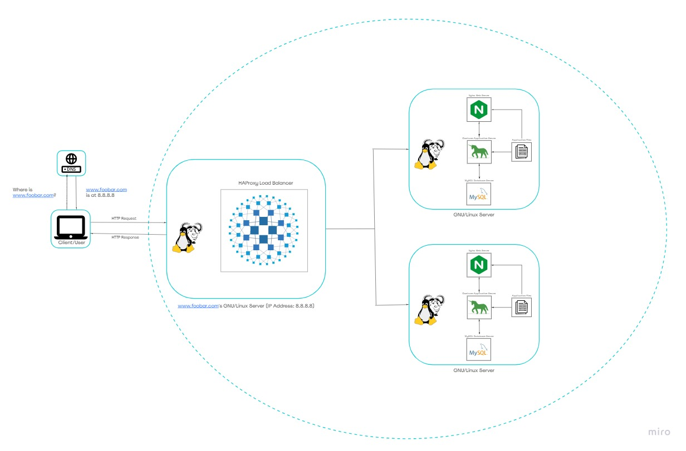

# Distributed Web Infrastructure

[Visit Board](https://miro.com/app/board/uXjVOfI6jcU=/)

## Description

Insert_here

## Specifics About This Infrastructure

+ The distribution algorithm the load balancer is configured with and how it works. The HAProxy load balancer is configured with Round Robin algorithm. This algorithm works by using each server behind the load balancer in turns, according to their weights. It’s also probably the smoothest and most fair algorithm as the servers’ processing time stays equally distributed. As a dynamic algorithm, Round Robin allows server weights to be adjusted on the go.
+ the HAProxy load-balancer enables an Active-Passive setup.  An <b>active-active setup</b> is made up of at least two nodes, both actively running the same kind of service simultaneously. The main purpose of an active-active cluster is to achieve load balancing. Load balancing distributes workloads across all nodes in order to prevent any single node from getting overloaded. Because there are more nodes available to serve, there will also be a marked improvement in throughput and response times. Like the active-active setup configuration, <b>an active-passive setup </b> also consists of at least two nodes. However, as the name "active-passive" implies, not all nodes are going to be active. In the case of two nodes, for example, if the first node is already active, the second node must be passive or on standby.
+ A master-slave setup means that one server is designated to act as the master. It is then required to receive all of the write queries. The master then executes and logs the queries, which is then shipped to the slave to execute and hence to keep the same data across all of the replication members.
+ A replica node is designed to mirror the master node configuration and the current cluster state in real time so that if the master nodes become unavailable the cluster can fail over to the replica nodes automatically whenever they are needed.

## Issues With This Infrastructure

+ There are multiple SPOF (Single Point Of Failure) in this infrastructure. For example, if the MySQL database server is down, the entire site would be down.

