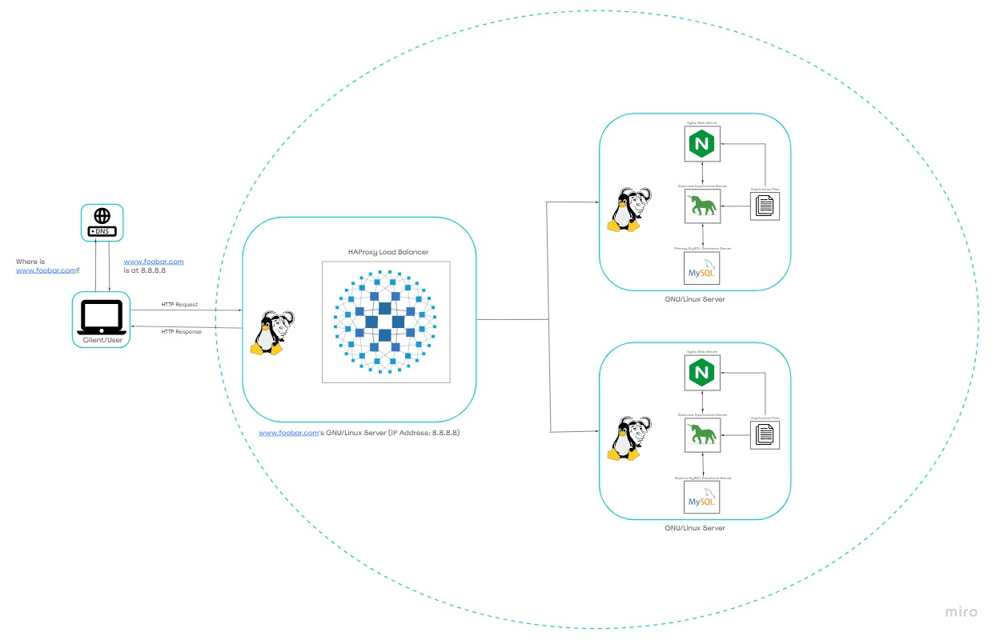

# Distributed Web Infrastructure

[Visit Board](https://miro.com/app/board/uXjVOfI6jcU=/)

## Description

Insert_here

## Specifics About This Infrastructure

+ The distribution algorithm the load balancer is configured with and how it works. The HAProxy load balancer is configured with ...

## Issues With This Infrastructure

+ SPOF.
